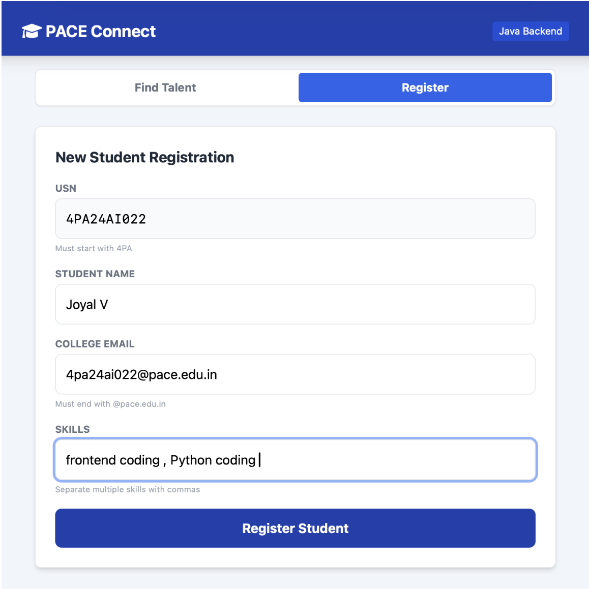
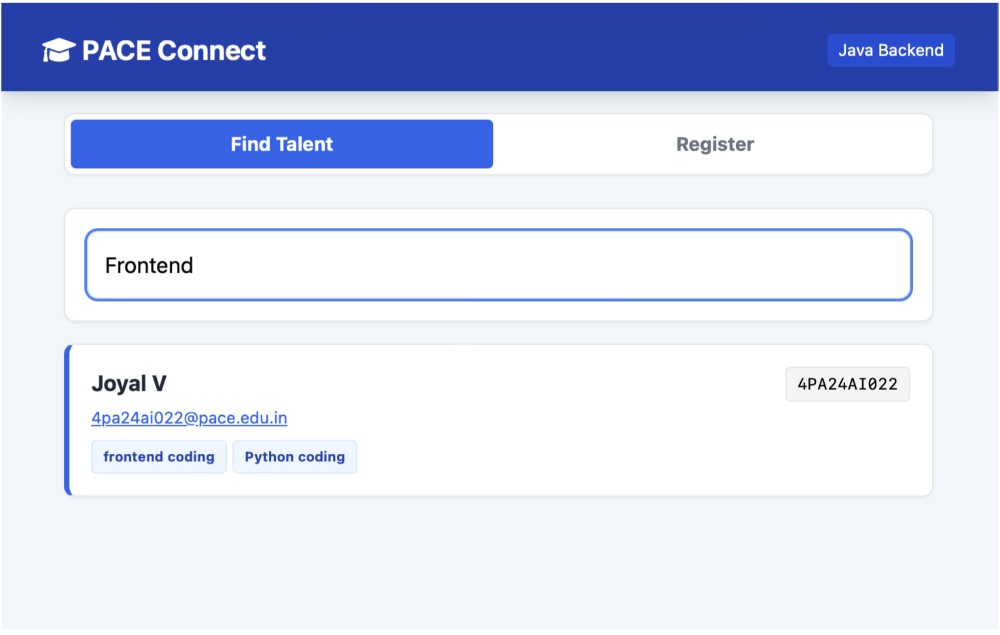

🚀 PACE Skill Connect

A Full-Stack Student Networking Platform built with Pure Java.

📖 About the Project

PACE Skill Connect is a localized networking application designed for PA College of Engineering. It helps students find teammates for hackathons and projects by bridging the gap between different skill sets (e.g., AI, Backend, Video Editing).

🛠️ Tech Stack

* Backend: Java (Custom HTTP Server, Multithreading, File I/O)

* Frontend: HTML5, TailwindCSS, JavaScript (REST API)

* Database: Text-file persistence (pace_students_db.txt)

* Security: Regex Validation for USN & Institutional Email

✨ Key Features

* Multi-threaded Server: Handles concurrent registrations using Java ExecutorService.

* Thread Safety: Uses synchronized blocks to prevent data corruption.

* Strict Validation: Restricts access to valid PACE students only (4PA... USN).

* Real-time Search: Filters students by skill instantly.

⚙️ How to Run Locally

Prerequisites

- Java Development Kit (JDK) 8 or higher.

Steps

- Clone the repository (or download the ZIP).

- Compile the Java Backend:

   * javac PaceBackend.java

Start the Server:

- java PaceBackend

**Access the App:**
(windows0
- use ngrok localhost 
- Open your browser and visit: http://localhost:8080

(Mac)
- open terminal
- paste this command : ssh -R 80:localhost:8080 nokey@localhost.run
- hit enter (make sure your network has no restritions for localhost)
- scan the qr and visit the website
  
  
📸 Screenshots

## 📸 Screenshots

### Registration Page

### Search Results

Submitted by Mohan Gowda K M   - 4PA24AI041
